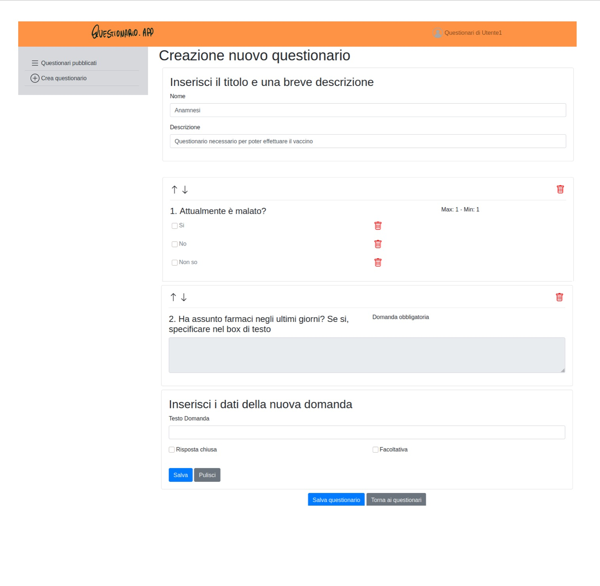

# Exam #1: "Questionario"
## Student: s281780 INGHILLERI GIACOMO 

## React Client Application Routes

- Route `/`: visualizza la tabella con i questionari e variano gli elementi interni in base al login
- Route `/new`: contiene il form per la creazione del questionario, quindi anche il form per la creazione delle domande e delle risposte
- Route `/result`: contiene il componente che permette la visualizzazione dei risultati in sola lettura
- Route `/compile`: visualizza il questionario e da la possibilita di compilarlo e di inviare i risultati
- Route `/login`: mostra la pagina di login

## API Server

- POST `/api/login`
  - request: username, password
  - response: user

- POST `/api/survey`
  - request: idUser, name, description
  - response: idSurvey

- POST `/api/question`
  - request: numberQ, idSurvey, text, type, optional, min, max
  - response: idQuestion

- POST `/api/answer`
  - request: idQuestion, numberA, text
  - response: null

- POST `/api/result`
  - request: client, idSurvey, numberQ, numberA, value
  - response: null

- GET `/api/surveys`
  - request:
  - response: [{id, name, description}, ...]

- GET `/api/surveys/:idUser`
  - request: id dell'utente creatore
  - response: [{id, name, description}, ...]

- GET `/api/questions/:idSurvey`
  - request: idSurvey
  - response: [{id, numberQ, text, type, optional, min, max, }, ...]

- GET `/api/answers/:idQuestion`
  - request: idQuestion
  - response: [{numberA, text}, ...]

- GET `/api/results/:idSurvey`
  - request: idSurvey
  - response: [{client, idSurvey, numberQ, numberA, value}, ...]

- GET `/api/clients/:idSurvey`
  - request: idSurvey
  - response: [client, ...]

- GET `/api/session/current`
  - request: user
  - response: user

- DELETE `/api/session/current`
  - request: 
  - response:

## Database Tables

- Table `survey` - contains id, iduser, name, description, viewers. Vengono memorizzate le informazioni relative ad un questionario
- Table `question` - contains id, numberQ, idSurvey, text, type, optional, min, max. Vengono memorizzate le informazioni relative alle domande
- Table `answer` - contains id, idQuestion, numberA, text. Vengono memorizzate le informazioni relative alle risposte che si possono scegliere per una domanda a risposta chiusa
- Table `result` - contains client, idSurvey, numberQ, numberA, value. Contiene i risultati per ogni singola domanda forniti dall'utente esterno
- Table `user` - contains id, email, password, name. Contiene le informazioni relative agli utenti.

## Main React Components

- `SurveyList` (in `SurveyList.js`): Componente che visualizza la tabella con le varie righe che contengono le informazioni sul questionario.
- `SurveyRow` (in `SurveyList.js`): Componente che crea la riga. Se l'utente è loggato vengono visualizzate il numero di visualizzazioni e il tasto per poter visualizzare i risultati. Se non è loggato viene visualizzato il tasto per compilare.
- `ModalCompile` (in `SurveyList.js`): Modal che permette l'inserimento del nome prima di poter iniziare a compilare il questionario
- `SurveyForm` (in `SurveyForm.js`): Viene gestita la creazione del questionario (quindi le operazioni di moveUp, moveDown e delete della domanda) e questo componente costruisce altri componenti per la creazione delle domande e delle risposte.
- `QuestionForm` (in `QuestionForm.js`): Crea il form per la creazione della domanda e quindi gestisce le funzionalita anche relative alle risposte aperte, e crea i componenti per la visualizzazione delle risposte chiuse create.
- `AnswerForm` (in `AnswerForm.js`): Gestisce la creazione delle risposte multiple
- `Module` (in `Module.js`): Carica le domande (e le relative risposte) di un questionario da DB e permette la compilazione. Gestisce l'invio dei risultati al DB.
- `ModuleRead` (in `ModuleRead.js`): Carica le domande e le risposte dal DB relative ad un questionario. Con i tasti è possibile cambiare l'utente esterno che ha risposto e quindi ad ogni cambio utente si vanno a ricaricare le risposte dal DB. Il tutto avviene in modalita di sola lettura
- `Question` (in `Questions&Answers.js`): componente che visualizza la domanda sia quando viene creata nel form, sia quando occorre visualizzare in modalita sola lettura per la visualizzazione delle risposte sia quando occorre compilare la domanda.
- `Answer` (in `Questions&Answers.js`): componente che visualizza la risposta. Viene visualizzato nelle stesse casistiche elencate prima per il componente Question 
- `HeaderNav` (in `HeaderNav.js`): barra superiore della schermata. Contiene il logo e il link per la possibilita di andare nella pagina di Login
- `LoginPage` (in `LoginPage.js`): crea la pagina per inserire i dati dell'utente creatore

## Screenshot

## Users Credentials

- utente1@polito.it, utente1 - Anamnesi
- utente2@polito.it, utente2 - Soddisfazione cliente AziendaA
